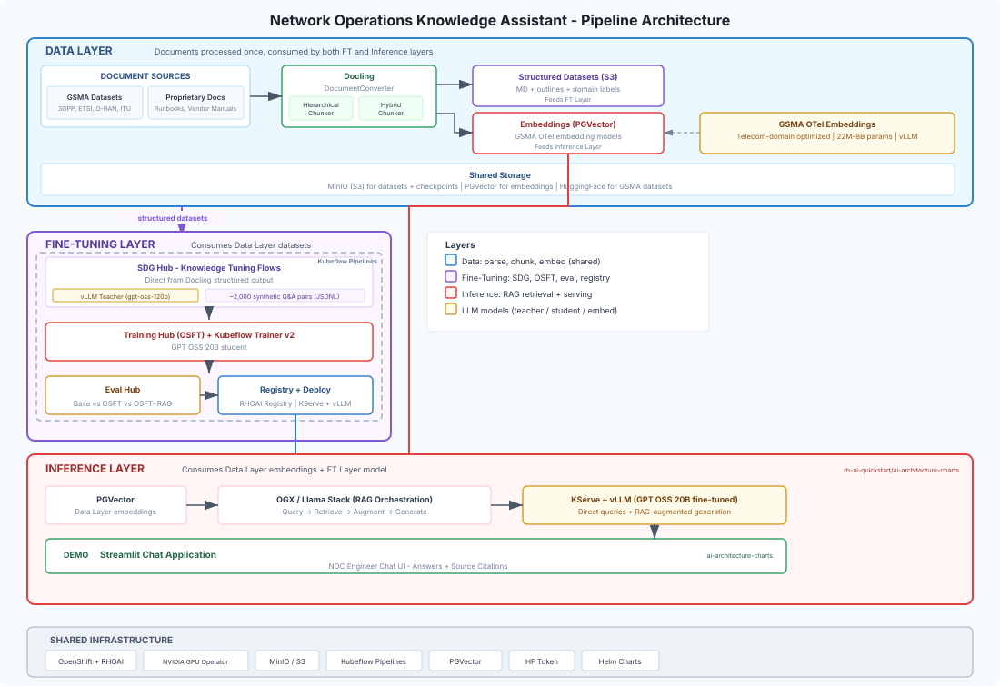

# Network Operations Knowledge Assistant Pipeline

## Purpose

An end-to-end pipeline that builds a **Network Operations Knowledge Assistant** — an AI assistant that helps telecom engineers troubleshoot network issues, reference NOC runbooks, and follow incident response procedures using accurate, domain-specific answers.

The assistant is built using a 3-layer architecture: a shared **Data Layer** processes documents into structured datasets and embeddings, a **Fine-Tuning Layer** generates synthetic training data with **SDG Hub** and fine-tunes with **OSFT** via **Training Hub**, and an **Inference Layer** serves the tuned model with **RAG** for grounded, source-backed responses. All components run on Red Hat OpenShift AI.

**Industry:** Telecommunications — Mobile Operators (GSMA audience)

**Intended Audience:**
- Mobile operators and telecom companies (GSMA members)
- Enterprise teams looking to build domain-specific AI assistants from internal knowledge
- ML platform teams evaluating alternatives to proprietary LLM APIs

**Reference Implementations:**
- [Knowledge tuning end-to-end example](https://github.com/red-hat-data-services/red-hat-ai-examples/tree/main/examples/knowledge-tuning)
- [SDG Hub knowledge tuning flow and examples](https://github.com/Red-Hat-AI-Innovation-Team/sdg_hub/tree/main/examples/knowledge_tuning)
- [SDG Hub documentation](https://ai-innovation.team/sdg_hub/)

## Architecture Diagram

## Component Selection

| Layer | Component | Source | Rationale |
|-------|-----------|--------|-----------|
| Data | [Docling](https://github.com/docling-project/docling) | IBM / LF AI & Data | Structure-aware parsing of PDF, DOCX, HTML; produces structured markdown and token-aware chunks |
| Data | [GSMA OTel Embedding Models](https://huggingface.co/GSMA) | GSMA | Telecom-domain optimized embeddings (22M–8B params); trained on 3GPP, O-RAN, RFCs |
| Data | [PGVector](https://github.com/pgvector/pgvector) | Open Source | Vector storage for embeddings; shared by FT and Inference layers |
| Fine-Tuning | [SDG Hub](https://github.com/Red-Hat-AI-Innovation-Team/sdg_hub) + [vLLM](https://github.com/vllm-project/vllm) Teacher | RHOAI | Composable YAML flows, knowledge tuning with faithfulness filtering |
| Fine-Tuning | [Training Hub](https://github.com/Red-Hat-AI-Innovation-Team/training_hub) (OSFT) + [Kubeflow Trainer v2](https://github.com/kubeflow/trainer) | RHOAI | Knowledge injection without catastrophic forgetting; distributed training orchestration |
| Fine-Tuning | [Eval Hub](https://github.com/eval-hub/eval-hub) | RHOAI | Standardized model evaluation across configurations |
| Fine-Tuning | RHOAI Model Registry + [KServe](https://github.com/kserve/kserve) + [vLLM](https://github.com/vllm-project/vllm) | RHOAI | Native registry workflow, serverless autoscaling, OpenAI-compatible API |
| Inference | OGX/Llama Stack + Ingestion Pipeline | [rh-ai-quickstart/ai-architecture-charts](https://github.com/rh-ai-quickstart/ai-architecture-charts) | RAG orchestration using Data Layer embeddings + FT Layer model |
| Demo | RHOAI Gen AI Studio (via ai-architecture-charts `playground` chart) | [rh-ai-quickstart/ai-architecture-charts](https://github.com/rh-ai-quickstart/ai-architecture-charts) | Registers OGX endpoint, vector stores, and MCP servers with RHOAI dashboard |

## Architecture Summary

The solution uses a 3-layer architecture as described in the [design issue](https://github.com/rh-ai-quickstart/ai-quickstart-contrib/issues/73). A shared Data Layer eliminates duplication between the training and serving paths — documents are processed once and consumed by both layers.

### Data Layer

Documents enter the pipeline from two source categories:
- **[GSMA Datasets](https://huggingface.co/GSMA/datasets)** on HuggingFace — includes 3GPP (104k docs), ETSI (121k docs), ITU (64.6k docs), O-RAN, IETF RFCs, and the [Telco-Common-Corpus](https://huggingface.co/datasets/GSMA/Telco-Common-Corpus) (1.78M docs)
- **Products and Releases Documentation** — proprietary operator-specific runbooks, vendor manuals, and internal NOC procedures

**[Docling](https://github.com/docling-project/docling)** parses all documents into structured `DoclingDocument` representations with section headers, tables, and metadata preserved. From this single parse, two outputs are produced:

- **Structured datasets** (for Fine-Tuning): The `HierarchicalChunker` preserves full document sections as structured markdown with outlines, feeding directly into SDG Hub as `document` + `document_outline` + `domain` fields. Domain labels are derived from the document's source category.
- **Embeddings** (for Inference): The `HybridChunker` produces token-aware chunks, embedded using **GSMA OTel embedding models**, and stored in **PGVector** for RAG retrieval.

Both outputs are persisted in shared storage (S3 for datasets, PGVector for embeddings) and are immediately available to downstream layers.

### Fine-Tuning Layer

Consumes the structured datasets from the Data Layer:

1. **SDG Hub** consumes the Docling structured output directly using the Key Facts flow for initial bootstrap and the Extractive Summary Knowledge Tuning flow for full-scale generation (2 of 4 available knowledge tuning flows). A **vLLM Teacher Model** (gpt-oss-120b) generates ~2,000 synthetic Q&A pairs (configurable) with built-in faithfulness and relevancy filtering. Quality-filtered outputs are formatted as OpenAI-format messages JSONL.

2. **Training Hub** fine-tunes **GPT OSS 20B** on the synthetic data using **OSFT** (Orthogonal Subspace Fine-Tuning), which injects domain knowledge while preserving the base model's general capabilities. Training is orchestrated at scale via **Kubeflow Trainer v2** TrainJob resources on OpenShift.

3. **Eval Hub** evaluates model outputs across three configurations (base model, OSFT-tuned, OSFT-tuned + RAG) using standardized telecom-domain benchmarks. On passing evaluation, the model is registered in the **RHOAI Model Registry** and deployed via **KServe + vLLM** as an OpenAI-compatible endpoint.

### Inference Layer

Consumes outputs from both the Data Layer (embeddings) and Fine-Tuning Layer (model):

The fine-tuned model is served via **KServe + vLLM**. The RAG pipeline is deployed via the **Ingestion Pipeline** chart (from [`rh-ai-quickstart/ai-architecture-charts`](https://github.com/rh-ai-quickstart/ai-architecture-charts)). **OGX** (or Llama Stack) orchestrates the RAG query pipeline — retrieving relevant document chunks from **PGVector** (populated by the Data Layer) and augmenting prompts to the fine-tuned model for grounded, source-cited responses.

The **RHOAI Gen AI Studio** (deployed via the `playground` chart from ai-architecture-charts) provides the demo interface, displaying the assistant's answers alongside retrieved source passages and document citations.

## Knowledge Domains

| Domain | Sample Sources | Coverage |
|--------|---------------|----------|
| Alarm Triage & Incident Response | [GSMA/3GPP](https://huggingface.co/datasets/GSMA/3GPP) (TS 32.111 Fault Management), NOC playbook templates | Alarm correlation, severity classification, initial diagnostics |
| IP/Transport Troubleshooting | [GSMA/etsi](https://huggingface.co/datasets/GSMA/etsi) (NFV MANO), [GSMA/Telco-Common-Corpus](https://huggingface.co/datasets/GSMA/Telco-Common-Corpus), proprietary NOC runbooks | BGP flap recovery, MPLS LSP repair, link failure procedures |
| RAN Operations | [GSMA/oran](https://huggingface.co/datasets/GSMA/oran), Products and Releases Documentation (proprietary) | Cell outage recovery, interference management, RIC troubleshooting |
| Core Network (5GC/EPC) | [GSMA/3GPP](https://huggingface.co/datasets/GSMA/3GPP) (TS 23.501, TS 32.111-6), [GSMA/itu](https://huggingface.co/datasets/GSMA/itu) | Signaling failures, subscriber service recovery, element failover |
| Escalation & Vendor Coordination | NOC procedure templates, Products and Releases Documentation (proprietary) | Tiered escalation, vendor RMA, change management approval |

## Shared Infrastructure

Deployment of the RAG and demo layers uses Helm charts from [`rh-ai-quickstart/ai-architecture-charts`](https://github.com/rh-ai-quickstart/ai-architecture-charts). This provides production-ready charts for:

| Component | Chart | Purpose |
|-----------|-------|---------|
| OpenShift + RHOAI | Platform | Platform layer |
| GPU Operator | Platform | GPU access for Data, FT, and Inference layers |
| MinIO | `minio` | S3-compatible object storage for datasets, checkpoints, model artifacts |
| PGVector | `pgvector` | Vector database shared by Data and Inference layers |
| LLM Service | `llm-service` | vLLM-based model serving with OpenAI-compatible API |
| OGX / Llama Stack | `ogx-ai` or `llama-stack` | RAG orchestration, agent capabilities, safety shields |
| Ingestion Pipeline | `ingestion-pipeline` | Document chunking, embedding, and vector store ingestion |
| Kubeflow Pipelines | Platform | Pipeline orchestration (production mode) |
| HuggingFace Token | Secret | Access to base model (GPT OSS 20B), teacher model, and GSMA datasets |

## Model Configuration

| Role | Model | Parameters | Notes |
|------|-------|-----------|-------|
| Teacher (SDG) | gpt-oss-120b | 120B | Default for SDG Hub knowledge tuning flows |
| Student (Fine-tuned) | GPT OSS 20B | 20B | OpenAI open-source model; fine-tuned with OSFT (`unfreeze_rank_ratio=0.2–0.3`) |
| Embedding | [GSMA OTel Embedding Models](https://huggingface.co/GSMA) | 22M–8B | Telecom-domain optimized; trained on 3GPP, O-RAN, IETF data; served via vLLM `--runner pooling` |

## GPU Hardware Configurations

Configurations below are sized for the models specified in Model Configuration above.

| Profile | Training (OSFT) | Serving (vLLM) | Embedding | Notes |
|---------|----------------|----------------|-----------|-------|
| A100 80GB | 2× A100 80GB | 1× A100 80GB | 1× T4/L4 | Recommended for production |
| A100 40GB | 4× A100 40GB | 2× A100 40GB | 1× T4/L4 | Alternative with more GPUs |
| L40S 48GB | 2× L40S | 2× L40S | 1× L40S | Cost-effective alternative |

## Licensing

| Component | License |
|-----------|---------|
| Docling | MIT |
| SDG Hub | Apache 2.0 |
| Eval Hub | Apache 2.0 |
| vLLM | Apache 2.0 |
| Training Hub | Apache 2.0 |
| Kubeflow Trainer | Apache 2.0 |
| PGVector | PostgreSQL License |
| OGX / Llama Stack | MIT |
| KServe | Apache 2.0 |
| Ingestion Pipeline | Apache 2.0 |
| ai-architecture-charts | Apache 2.0 |
| GSMA Datasets | Apache 2.0 |
| RHOAI | Red Hat Subscription |

